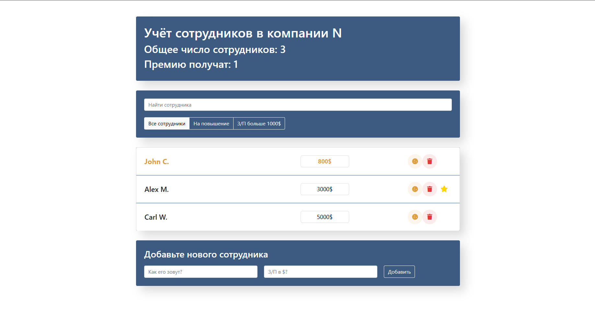

# 👥 React Employee Manager

> SPA для управления сотрудниками компании: полный цикл работы с данными, фильтрация, статистика и адаптивный интерфейс.



## 📌 О происхождении проекта

> **Важно:** Проект изначально разрабатывался в приватном репозитории в рамках учебного курса "Полный курс по JavaScript + React – Udemy (Иван Петриченко)". Код был перенесён в этот публичный репозиторий после завершения работы для демонстрации портфолио. Поэтому история коммитов не отражает реальной хронологии разработки.

## 🚀 Демо и репозиторий

- **Демо:** [https://sw1ftfox.github.io/react-employee-manager/](https://sw1ftfox.github.io/react-employee-manager/)
- **Репозиторий:** [https://github.com/Sw1ftFox/react-employee-manager](https://github.com/Sw1ftFox/react-employee-manager)

## 📦 Стек технологий

| Категория             | Технологии                  |
| --------------------- | --------------------------- |
| Язык / фреймворк      | React, JavaScript (ES6+)    |
| Сборка                | Create React App            |
| Стилизация            | CSS                         |
| Управление состоянием | Локальный state компонентов |
| Хостинг               | GitHub Pages                |

## ✨ Особенности

- **CRUD‑операции** – добавление, редактирование, удаление сотрудников.
- **Динамическая статистика** – общее число сотрудников и количество премированных.
- **Система фильтрации** – «все сотрудники», «на повышение», «з/п > 1000$».
- **Поиск по имени** – быстрый поиск сотрудника.
- **Управление статусами** – назначение премии (🍪), отметка о повышении (клик на имя), изменение зарплаты (клик на поле).
- **Адаптивный интерфейс** – корректное отображение на всех устройствах.

## 🛠️ Установка и запуск

```bash
git clone https://github.com/Sw1ftFox/react-employee-manager.git
cd react-employee-manager
npm install
npm start
```

## 📂 Структура проекта (основные папки)

```
src/
├── components/
│   ├── app/                  # Корневой компонент
│   ├── app-filter/           # Компонент фильтрации
│   ├── app-info/             # Блок статистики
│   ├── employees-add-form/   # Форма добавления сотрудника
│   ├── employees-list/       # Список сотрудников
│   ├── employees-list-item/  # Карточка сотрудника
│   └── search-panel/         # Поиск
├── index.css                 # Глобальные стили
└── index.js                  # Точка входа
```
